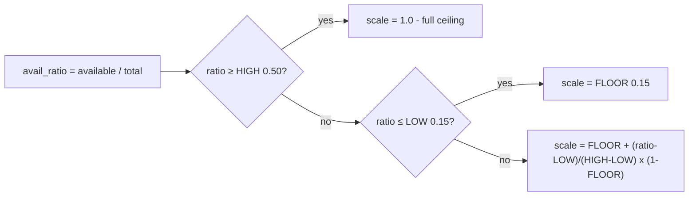
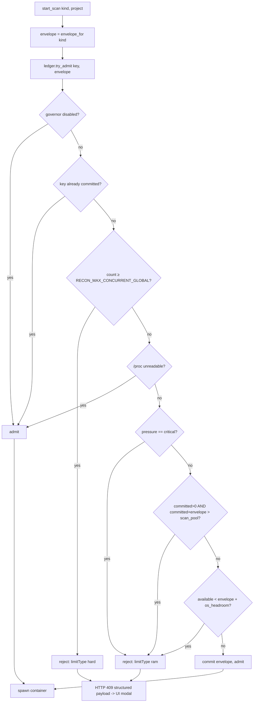
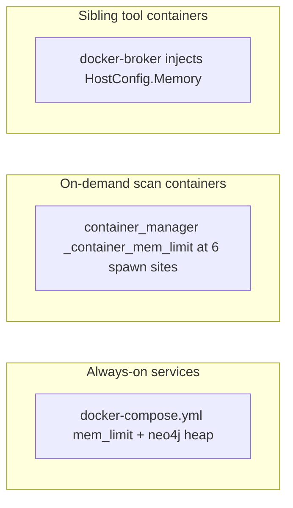
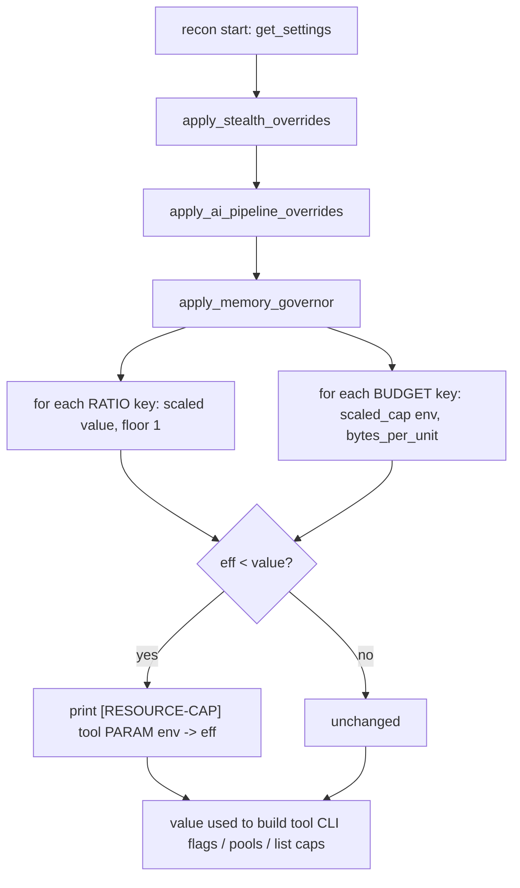

# Memory Governor (RAM Management) - Technical Reference

This document explains, end to end, how RedAmon keeps a single host from running out
of RAM while many recon scans and agent chat sessions run at once. It is written for
an engineer who needs to understand, operate, debug, or extend the system. It starts
with the problem and the core model, then dives into every component, data structure,
decision, and environment variable. All diagrams are Mermaid (no colour, so they read
correctly in both light and dark themes).

---

## 1. The problem, in one paragraph

RedAmon runs everything on one host: Postgres, Neo4j, the agent, the orchestrator, the
webapp, and, on demand, up to a dozen recon scan containers, each of which spawns its
own sibling tool containers (naabu, httpx, katana, nuclei, gau, …). Historically none of
this was memory-aware: every concurrency, parallelism, worker, and `*_MAX_*` list value
was a fixed number, no container had a `mem_limit`, and nothing read how much RAM was
free. A single runaway crawl (`KATANA_MAX_URLS=300000`) or six parallel scans could
exhaust host RAM and trigger the kernel OOM killer, which picks a *random* victim, often
Postgres or Neo4j, taking the whole stack down. The **memory governor** is the subsystem
that makes RAM a first-class, actively-managed resource so this can never happen.

---

## 2. Core concept: the dual-cap model

Every RAM-relevant knob keeps the value you configure (the **hard ceiling**) and gains a
**second, dynamic cap** computed at runtime from the memory actually available. The
effective value is always the smaller of the two, so the dynamic cap can only ever
throttle **down** under pressure, never above your ceiling.

```
effective = min( configured_ceiling , dynamic_cap(available_ram) )
```

There are two dynamic models, chosen by *what one unit of the knob is*:

| Model | Applies to | Formula |
|---|---|---|
| **RATIO** | in-process concurrency: threads, `-c`/`-t`, thread-pool widths | `clamp( round(value × scale), floor, value )` |
| **BYTE-BUDGET** | anything that costs real megabytes: a process, a container, a session, or an in-memory `*_MAX_*` list | `clamp( available × fraction ÷ per_unit_bytes, floor, ceiling )` |

The RATIO model is a proportional throttle keyed on `available / total`. The BYTE-BUDGET
model answers the sharper question "how many of these actually fit in the RAM I have?",
which is the right question for absolute-cost units, because scaling a *count* by a ratio
is wrong when one unit is real megabytes (ten headless browsers are ~3 GB regardless of
the available/total ratio).

On top of these dynamic caps sit **hard backstops**, a startup RAM gate, generous
per-container `mem_limit`s, and a reservation ledger, so the host can never OOM even if a
dynamic estimate is wrong. Everything **fails open**: if `/proc/meminfo` is unreadable or
the governor is disabled, all caps collapse to the configured ceilings (legacy behavior).

---

## 3. Architecture overview

The governor is not one service; it is a small dependency-free module vendored into three
independent packages plus a set of backstops applied at container-creation choke points.

```mermaid
flowchart TB
    subgraph host[Host / Docker VM]
        proc[/proc/meminfo + /proc/stat]
    end

    subgraph gov[MemoryGovernor module - stdlib only]
        core[read_mem, scale, scaled, scaled_cap, pressure, log_cap]
        prof[resource_profile.json - measured envelopes]
    end

    subgraph orch[recon-orchestrator]
        ledger[Reservation Ledger - scan admission]
        cmgr[container_manager - spawn caps + reconcile]
        stats[GET /system/stats]
    end

    subgraph recon[recon container - spawned per scan]
        rgov[apply_memory_governor - tool params]
    end

    subgraph agent[agent container]
        agov[apply_memory_governor - fireteam/plan]
        caps[session cap, job cap]
    end

    subgraph broker[docker-broker]
        inj[inject HostConfig.Memory into siblings]
    end

    subgraph sh[redamon.sh]
        gate[startup RAM gate]
        export[export per-service caps]
    end

    proc --> core
    prof --> core
    core --> ledger
    core --> rgov
    core --> agov
    core --> caps
    core --> inj
    ledger --> cmgr
    cmgr -->|mem_limit| recon
    recon -->|docker run via broker| broker
    broker -->|2GB cap| siblings[sibling tool containers]
    export -->|mem_limit env| compose[docker-compose services]
    stats --> ui[webapp: bottom-bar meters, modal, red logs]
```

Key placement facts that shape the design:

- **The three packages do not share code.** `recon/`, `agentic/`, and `recon_orchestrator/`
  are separate top-level Python packages with separate Dockerfiles; the dependency edge is
  one-directional (the orchestrator spawns the others via env vars + JSON files + the
  webapp API). So the governor is a small stdlib-only module **vendored per package**,
  mirroring how `project_settings.py` is already duplicated. Canonical copy lives in
  `graph_db/resource_governor.py` (mounted into scan containers, baked into the agent
  image); a byte-identical copy lives in `recon_orchestrator/resource_governor.py`.
- **`/proc` is the universal sensor.** Inside every Linux container `/proc/meminfo` and
  `/proc/stat` report the *host* totals (or, on Docker Desktop, the VM totals, which is
  the correct ceiling to govern against). No `psutil` dependency, no per-OS code path.
- **The orchestrator is the only Docker-privileged component.** It holds the real Docker
  socket, so container admission, per-spawn caps, and live `container.stats()` sampling all
  live there.

---

## 4. The MemoryGovernor module (`graph_db/resource_governor.py`)

This is the core. It is pure Python (stdlib only) and fail-open. Public API:

| Function | Purpose |
|---|---|
| `read_mem() -> (total, available)` | Parse `/proc/meminfo` (`MemTotal`, `MemAvailable`), cache ~`MEM_READ_TTL_S`. Returns `None` if unreadable. A test override (`set_mem_override`) injects synthetic values. |
| `avail_ratio()` | `available / total`, clamped to `(0,1]`. |
| `scale()` | The RATIO factor in `(0,1]`. Piecewise: `≥MEM_SCALE_HIGH → 1.0`; `≤MEM_SCALE_LOW → MEM_SCALE_FLOOR`; linear ramp between. |
| `scaled(value, floor)` | RATIO model. `clamp(round(value×scale()), floor, value)`. Never exceeds `value`. |
| `scaled_cap(env_cap, per_unit_bytes, fraction, floor)` | BYTE-BUDGET model. `clamp(available×fraction // per_unit_bytes, floor, env_cap)`. |
| `pressure()` | `"ok"` / `"warn"` / `"critical"` from `avail_ratio` vs the LOW/HIGH bands. Drives admission blocking. |
| `cpu_percent()` / `cpu_cores()` | Host CPU utilisation from `/proc/stat` deltas (for the UI meter). |
| `parse_size(s)` / `env_bytes(name, default)` | Parse Docker-style sizes (`2g`, `512m`, plain bytes) from env. |
| `load_profile()` / `bytes_per_unit()` / `envelope()` / `scan_job_envelope()` / `tool_container_envelope()` | Read the measured `resource_profile.json`, merged over built-in fallbacks. |
| `log_cap(tool, param, env, eff, reason)` | Print the `[RESOURCE-CAP] …` marker line (rendered red in the recon drawer), only when a value was actually reduced. |

### 4.1 The scale curve



Worked example: on a 32 GB host with 8 GB free, `ratio = 0.25`. That is between LOW (0.15)
and HIGH (0.50), so `scale = 0.15 + (0.25-0.15)/(0.50-0.15) × 0.85 ≈ 0.39`. A
`NUCLEI_CONCURRENCY` of 25 becomes `round(25 × 0.39) = 10`.

### 4.2 The byte-budget

For an absolute-cost unit the governor divides a *fraction* of currently-available RAM by
the measured cost of one unit. Example: `KATANA_MAX_URLS = 300000`, fallback
`bytes_per_unit("url") = 600 B`, `MEM_BUDGET_FRACTION = 0.10`, 512 MB available →
`min(300000, 536870912 × 0.10 ÷ 600) = min(300000, 89478) = 89478` URLs. (Calibration
replaces the 600 B fallback with the measured, tolerance-inflated slope for this host.)

### 4.3 The measured profile

`resource_profile.json` holds measured, tolerance-inflated figures, `bytes_per_unit` per
sink family, per-scan-type and per-tool container envelopes, and `service_baseline_bytes`.
It is **host-specific** (generated by calibration, gitignored) and merged over conservative
built-in fallbacks, so the governor works safely before any calibration run.

---

## 5. Scan admission, the reservation ledger (`recon_orchestrator/admission_ledger.py`)

This is the primary OOM guarantee for recon. It partitions host RAM:

```
host_total
├─ os_headroom       (OS_HEADROOM_MEM, ~2 GB, never allocated)
├─ service_baseline  (SERVICE_BASELINE_MEM, sum of always-on services)
└─ scan_pool = host_total − os_headroom − service_baseline
```

A scan is admitted only if its **envelope** (expected peak memory of the container + its
siblings) still fits the pool. The ledger reserves the *envelope*, not current usage,
because containers allocate lazily: reading instantaneous free RAM would let many jobs each
see "plenty free" and then grow into a joint OOM.



Notes:

- **First-scan exemption.** The pool check is skipped when `committed == 0`, so the *sole*
  scan is never denied on budget grounds (which would brick small hosts); the physical
  `available` check still guards it.
- **Typed rejections.** A rejection returns `AdmissionError` carrying `{limitType: "hard"|"ram",
  settingName, current, ceiling, detail}`, which the orchestrator maps to an HTTP 409 with
  that structured body, the webapp turns it into a tailored modal.
- **Leak-proof release.** Reservations are freed by `reconcile()`, called every 30 s from the
  reaper. It first refreshes every scan's status from Docker (so a scan that finished with
  its UI tab closed is detected), then drops any committed key that is no longer
  `RUNNING`/`STARTING`/`PAUSED`. This is more robust than hooking every terminal path.

Per-scan envelopes come from `RECON_JOB_ENVELOPE_MEM` (env override) or the measured
`scan_job_envelope_bytes` (else a conservative fallback). `RECON_MAX_CONCURRENT_GLOBAL` is
an optional secondary hard count cap across *all* projects (`0` blocks all new scans; unset
= bytes-ledger only).

---

## 6. Per-container hard caps (the enforcement backstop)

Admission bounds the *sum of estimated envelopes*; it assumes each container honours its
estimate. Nothing physically forces that, a buggy tool could blow past its envelope. So
every container also gets a hard `mem_limit`, sized generously so it almost never fires; its
only job is to make the reservation math trustworthy and to contain a genuine runaway.
There are three creation choke points, so caps are applied in three places:



1. **Always-on services** (`docker-compose.yml`): `mem_limit` on neo4j, postgres, agent,
   orchestrator, webapp, kali, gvmd. Neo4j also gets explicit JVM `heap` + `pagecache` env,
   because a `mem_limit` alone OOM-kills the JVM, the container limit must exceed
   heap + pagecache + overhead. Values default to safe constants and are overridden by
   host-adaptive values exported from `redamon.sh` (§9).
2. **On-demand scan containers** (`container_manager._container_mem_limit`): each of the 6
   `containers.run()` spawns (full/partial recon, ai-attack, gvm, github-hunt, trufflehog)
   gets `cap = clamp( envelope × CONTAINER_CAP_HEADROOM , envelope , PER_CONTAINER_MAX )`.
   Floored at the envelope so a normal peak is never killed; clamped at `PER_CONTAINER_MAX`
   (a large fraction of host RAM) so one container can never take the whole host and starve
   the DB. Returns `None` (no limit) when the governor is disabled.
3. **Sibling tool containers** (`docker_broker/broker.py`): the recon container spawns
   naabu/httpx/katana/… as *separate top-level containers* through the docker-broker's
   filtered socket, so the recon container's own `mem_limit` cannot reach them. The broker
   is the only choke point every sibling-create request passes through. After its security
   `validate_create` passes, it injects `HostConfig.Memory` (`BROKER_TOOL_MEM_BYTES`, default
   2 GB) into the create body, re-serialises it, and rewrites `Content-Length` before
   forwarding. The injection is strictly additive, it never relaxes a deny rule.

There are **no CPU caps anywhere**, by design: CPU oversubscription only causes the scheduler
to time-slice (graceful slowdown), never OOM; a CPU cap would throttle idle cores. Bounding
the job/session/container count already bounds CPU contention.

---

## 7. Recon parameter scaling (`recon/project_settings.py`)

The recon pipeline reads its settings once at container start (a single HTTP fetch, memoised
into a singleton). `apply_memory_governor(settings)` is applied there, after Stealth-mode
and RoE overrides, so it tightens whatever they leave, mirroring the existing
`apply_stealth_overrides` pattern. It walks two curated key maps:

- `_GOV_RATIO_KEYS`, ~45 concurrency/thread/worker/parallelism keys (DNS, naabu, httpx,
  nuclei, katana, gau, ffuf, jsluice, kiterunner, the OSINT `*_WORKERS`, …). Scaled by the
  RATIO model, floor 1.
- `_GOV_BUDGET_KEYS`, ~18 in-memory accumulators (`KATANA_MAX_URLS`, `GAU_MAX_URLS`,
  `*_MAX_FILES`, `*_MAX_RESULTS`, `VHOST_SNI_MAX_CANDIDATES_PER_IP`, …). Scaled by the
  BYTE-BUDGET model using the measured `bytes_per_unit` of their family.



Because the scaling happens at scan start, it samples the RAM available at the moment the
scan is admitted (the "calling time"). It does not re-sample mid-run, the per-container and
broker hard caps backstop any mid-run growth. Every reduction prints a `[RESOURCE-CAP]` line
to the recon container's stdout, which streams into the recon-logs drawer and renders red.

---

## 8. Agent concurrency governance (`agentic/`)

The agent re-fetches settings **per turn** (`load_project_settings`), so its governor adapts
each turn. Because a fireteam member (~512 MB of graph state) and a plan-parallel tool slot
(~400 MB, possibly a full chromium) each cost real megabytes, the agent uses the
**BYTE-BUDGET** model with a larger fraction (`AGENT_MEM_BUDGET_FRACTION`, default 0.5) so the
full value survives at reasonable RAM and only throttles hard when memory is genuinely scarce.

- `FIRETEAM_MAX_CONCURRENT` and `PLAN_MAX_PARALLEL_TOOLS` are byte-budgeted in
  `apply_memory_governor`. `FIRETEAM_MAX_MEMBERS` is deliberately **not** scaled, scaling
  membership would silently truncate a coordinated plan across a resume; scaling
  *concurrency* serializes members safely instead.
- **Two admission caps that did not exist before** were added:
  - **Concurrent chat sessions** (`websocket_api._governed_max_sessions`, `MAX_AGENT_SESSIONS`
    default 20): byte-budgeted on `agent_session_envelope_bytes`. A genuinely new session is
    refused (socket closed, `authenticated` left false) past the cap; reconnects to an
    existing key always pass.
  - **Background jobs** (`job_runner._governed_max_jobs`, `MAX_BACKGROUND_JOBS` default 16):
    byte-budgeted on `background_job_envelope_bytes`. Count-and-insert is atomic under the
    registry lock.
- **MCP terminal sessions** (`mcp/servers/terminal_server`): the existing
  `TERMINAL_MAX_SESSIONS` (default 5) is further reduced under pressure by the byte-budget.

These agent caps are graceful-degradation, not the host-OOM guarantee, the agent and kali
containers already have hard `mem_limit`s (§6), so an unbounded number of sessions could at
worst OOM-restart the agent container in isolation; the caps prevent even that.

---

## 9. Backstops in `redamon.sh`, startup gate, cap export, zram

`redamon.sh` reuses its existing `detect_build_resources()` (reads `docker info MemTotal`,
falling back to `/proc/meminfo` or macOS `sysctl`) for three host-side functions:

- **`preflight_ram_gate`**, called before `docker compose up`. If detected RAM is below
  `SERVICE_BASELINE_MEM + OS_HEADROOM_MEM` (with a 512 MB tolerance for kernel overhead), it
  prints a clear message and aborts, turning a mysterious mid-scan OOM into an upfront,
  actionable error. Override with `REDAMON_SKIP_RAM_GATE=1` or `REDAMON_MIN_RAM_MB=<mb>`.
- **`export_resource_caps`**, derives per-service `mem_limit`s from detected RAM and exports
  them so `docker-compose.yml`'s `${VAR:-default}` interpolation picks them up. Crucially it
  derives `NEO4J_MEM` from the *effective* heap + pagecache + overhead (never below the JVM
  heap), so an operator-set `NEO4J_HEAP` can't produce an OOM-on-boot cap. Run on `up` and,
  since a recent fix, on `update` too when `docker-compose.yml` changed.
- **`setup_zram`**, optional, Linux-native host only (a no-op on Docker Desktop / WSL). When
  `REDAMON_ENABLE_ZRAM=1`, it sets up a one-time compressed-RAM swap cushion (zstd) so brief
  overshoots degrade gracefully instead of OOM-killing. Best-effort, never interactive
  (`sudo -n`), never fatal.

---

## 10. Calibration (`recon_orchestrator/mem_calibrate.py`)

Every byte figure the governor relies on is meant to be *measured*, not guessed. The
calibration harness uses the orchestrator's Docker SDK to sample real per-container memory
and writes `resource_profile.json` (each value = `measured × (1 + MEM_SAFETY_TOLERANCE)`):

- `bash tests/redamon_mem_calibrate.sh baseline`, samples the always-on core services →
  `service_baseline_bytes` (accurate, steady-state).
- `bash tests/redamon_mem_calibrate.sh scan <project_id>`, starts a real scan and samples
  the recon container + sibling tools → per-scan-type and per-tool envelopes.

Safety detail: an envelope is a worst-case upper bound, but a fixed-window sample only sees
the phases active during it. So a measured scan/tool envelope may only **raise** the value
above the conservative built-in floor, never lower it, a partial scan can't produce a
too-small (over-admitting) envelope. `service_baseline` (steady-state) is used directly.

The profile is host-specific and **gitignored**, each host generates its own; the governor
uses safe built-in fallbacks when it is absent.

---

## 11. The UI (Part 5)

- **`GET /system/stats`** on the orchestrator returns `{ mem: {host_total, available,
  os_headroom, service_baseline, scan_pool, committed, active_scans, remaining_for_new,
  pressure}, cpu: {percent, cores}, governor_enabled }`. The webapp proxies it at
  `/api/system/stats` (5 s poll, shared by all consumers).
- **Bottom-bar htop meter** (footer, bottom-right): `RAM ▓▓▓ 64% · 11.3 GB free` and
  `CPU ▓▓ 12%`. The number shown is physical free RAM (`available`), consistent with the bar
  %. The governor's separate `remaining_for_new` (free RAM minus what running scans reserved)
  is in the tooltip, clearly labeled, the two are different metrics and were a common source
  of confusion.
- **Red `[RESOURCE-CAP]` log lines** in the recon-logs drawer (substring match on the marker).
- **Limit modal** on a refused scan: the orchestrator's structured 409 (`limitType`) is
  surfaced by the recon-start handler as a tailored `hard` ("raise setting X") vs `ram`
  ("retry once memory frees") message.

---

## 12. Complete environment variable reference

All are optional; defaults live in code (empty/unset → default). Documented in
[.env.example](../.env.example). Sizes accept `2g` / `512m` / plain-bytes.

### Master switch

| Var | Default | Meaning |
|---|---|---|
| `REDAMON_MEM_GOVERNOR` | on | Master on/off. When off, every dynamic cap collapses to the configured ceiling (legacy behavior). |

### RATIO model (in-process concurrency)

| Var | Default | Meaning |
|---|---|---|
| `MEM_SCALE_HIGH` | `0.50` | avail/total ratio at/above which parallelism runs at the full ceiling. |
| `MEM_SCALE_LOW` | `0.15` | ratio at/below which parallelism is throttled to the floor. |
| `MEM_SCALE_FLOOR` | `0.15` | floor scale factor; parallelism never drops below this fraction of the ceiling. |
| `MEM_READ_TTL_S` | `2` | seconds to cache the `/proc/meminfo` read so a wide fan-out doesn't hammer it. |

### BYTE-BUDGET model

| Var | Default | Meaning |
|---|---|---|
| `MEM_SAFETY_TOLERANCE` | `0.25` | margin added over every *measured* byte figure (+25%). |
| `MEM_BUDGET_FRACTION` | `0.10` | share of available RAM a single recon memory-sink list may claim. |
| `AGENT_MEM_BUDGET_FRACTION` | `0.5` | share of available RAM the agent's concurrent members/tools/sessions may claim (higher, so full value survives at reasonable RAM). |
| `RESOURCE_PROFILE_PATH` | `resource_profile.json` | path to the measured calibration profile. |

### Scan admission (reservation ledger)

| Var | Default | Meaning |
|---|---|---|
| `OS_HEADROOM_MEM` | `2g` | RAM reserved for the OS/kernel, never handed to work. |
| `SERVICE_BASELINE_MEM` | measured, else `6g` | total RAM the always-on services use; subtracted from the scan pool and used by the startup gate. |
| `RECON_JOB_ENVELOPE_MEM` | measured, else `4g` | expected peak RAM of one recon job (container + siblings), the unit the pool is divided into. `0`/invalid is ignored. |
| `RECON_MAX_CONCURRENT_GLOBAL` | unset (bytes-ledger only) | optional hard count cap on globally-concurrent scans across all projects. `0` blocks all new scans. |

### Agent caps

| Var | Default | Meaning |
|---|---|---|
| `MAX_AGENT_SESSIONS` | `20` | ceiling on concurrent agent chat/WebSocket sessions (byte-budgeted down under pressure). |
| `MAX_BACKGROUND_JOBS` | `16` | ceiling on concurrent background agent jobs (byte-budgeted). |
| `TERMINAL_MAX_SESSIONS` | `5` | max concurrent kali-sandbox PTY sessions; further reduced under pressure. |

### On-demand scan-container caps (spawn-time)

Each is computed at spawn from the RAM-scaled envelope × headroom, clamped to
`PER_CONTAINER_MAX`; set one to force a fixed ceiling for that scan type.

| Var | Meaning |
|---|---|
| `RECON_CONTAINER_MEM` | full + partial recon container cap. |
| `AI_ATTACK_MEM` | AI attack-surface scan container cap. |
| `GVM_SCAN_MEM` | GVM scan container cap. |
| `GITHUB_HUNT_MEM` | GitHub secret-hunt container cap. |
| `TRUFFLEHOG_MEM` | TruffleHog scan container cap. |
| `PER_CONTAINER_MAX` | `~55%` of host, absolute ceiling any single container may use, so one can't take the whole host. |
| `CONTAINER_CAP_HEADROOM` | `1.5`, multiplier setting each cap above the admission envelope, so a normal peak is never killed. |

### Always-on service caps (compose)

| Var | Meaning |
|---|---|
| `NEO4J_HEAP` | neo4j JVM max/initial heap. Must accompany the neo4j `mem_limit` or the JVM OOM-kills. |
| `NEO4J_PAGECACHE` | neo4j page-cache size. |
| `NEO4J_MEM` | neo4j container `mem_limit`; derived as heap + pagecache + overhead (never below the heap). |
| `GVMD_MEM`, `AGENT_MEM`, `RECON_ORCHESTRATOR_MEM`, `WEBAPP_MEM`, `POSTGRES_MEM`, `KALI_MEM` | container `mem_limit` for each always-on service. |
| `WEBAPP_DEV_MEM` | `4g`, dev-mode override (`up dev`); `next dev` compilation needs far more than prod, so the 1 GB prod cap is relaxed here. |

### Sibling tool containers (broker)

| Var | Default | Meaning |
|---|---|---|
| `BROKER_TOOL_MEM_BYTES` | `2g` | hard memory cap injected into every sibling tool container (katana/nuclei/…). |
| `BROKER_TOOL_PIDS` | `0` (unset) | optional PIDs limit for sibling containers; `0` = don't set. Parsed defensively (a bad value can't crash the broker). |

### Startup gate & zram (redamon.sh)

| Var | Default | Meaning |
|---|---|---|
| `REDAMON_SKIP_RAM_GATE` | unset | set `1` to skip the startup RAM-sufficiency check. |
| `REDAMON_MIN_RAM_MB` | derived from baseline+headroom | explicit minimum-RAM threshold (MB) for the gate. |
| `REDAMON_ENABLE_ZRAM` | off | set `1` to set up a one-time compressed-RAM (zram) swap cushion on a native Linux host. |
| `REDAMON_ZRAM_SIZE` | half of RAM, capped 8 GB | explicit zram device size. |
| `REDAMON_BUILD_PARALLEL` | derived | (pre-existing) caps image-build parallelism; part of the same adaptive-memory build path. |

---

## 13. Failure modes & the fail-open contract

The governor is safety infrastructure, so it degrades toward *doing nothing* rather than
blocking legitimate work:

- **`/proc/meminfo` unreadable** → `read_mem()` returns `None`; `scale()` returns `1.0`,
  `scaled_cap()` returns the env ceiling, and admission **admits** (both halves agree). Behavior
  reverts to legacy static limits.
- **Governor disabled** (`REDAMON_MEM_GOVERNOR` off) → identical to the unreadable case.
- **Profile absent/corrupt** → built-in conservative fallback constants are used.
- **A cap sized too small** → an ephemeral scan/tool is OOM-killed in isolation (exit 137),
  the job reports the tool failure gracefully, the reaper logs the event, and the host
  survives. This is the intended blast-radius, not a bug.
- **Direction of error is always "bigger."** Because host-OOM is prevented by the reservation
  budget (the sum), not by any single cap being tight, every cap errs generous, an oversized
  cap only lowers concurrency, it can never cause OOM.

---

## 14. Testing

| Suite | Covers |
|---|---|
| [tests/test_resource_governor.py](../tests/test_resource_governor.py) | scale/scaled/scaled_cap math, clamps, fail-open, `/proc` parsing, size parsing, profile loading, cap logging. |
| [tests/test_admission_ledger.py](../tests/test_admission_ledger.py) | admit/reject/reconcile accounting, typed rejections, first-scan exemption, count cap, fail-open. |
| [tests/test_broker_inject.py](../tests/test_broker_inject.py) | `inject_limits` add/cap/respect-lower, size parsing, body re-serialisation. |
| [tests/test_recon_mem_governor.py](../tests/test_recon_mem_governor.py) | recon `apply_memory_governor` ratio + byte-budget scaling, `[RESOURCE-CAP]` emission, guards. |
| [tests/test_agent_mem_governor.py](../tests/test_agent_mem_governor.py) | agent byte-budget scaling of fireteam/plan keys, small-host throttle, guards. |
| [tests/redamon_governor_test.sh](../tests/redamon_governor_test.sh) | bash: `_size_to_mb`, `preflight_ram_gate`, `export_resource_caps` (incl. neo4j heap coherence), `setup_zram` guards. |

Run the Python suites with `python3 -m unittest tests.test_resource_governor …` and the bash
suite with `bash tests/redamon_governor_test.sh`. The governor and ledger modules are pure
stdlib and run on the host with no Docker.

---

## 15. Operate & debug

```bash
# Live governor state (mem budget + CPU + pressure)
docker compose exec -T recon-orchestrator python3 -c "import os,urllib.request,json; \
k=os.environ['ORCHESTRATOR_API_KEY']; \
print(urllib.request.urlopen(urllib.request.Request('http://localhost:8010/system/stats', \
headers={'X-Orchestrator-Key':k})).read().decode())"

# Admissions & denials
docker compose logs recon-orchestrator | grep '\[governor\]'

# Per-scan parameter throttling (red in the UI drawer)
docker logs <redamon-recon-...> | grep RESOURCE-CAP

# Confirm every container carries a hard mem_limit (0 = uncapped)
for c in $(docker ps --format '{{.Names}}' | grep redamon); do \
  echo "$c $(docker inspect $c --format '{{.HostConfig.Memory}}')"; done

# Confirm broker injects the sibling cap (during a scan)
docker compose logs docker-broker | grep 'ALLOW create'   # shows mem=<bytes>

# Re-measure this host's envelopes
bash tests/redamon_mem_calibrate.sh baseline
```

Common questions:

- *"Bottom bar says 64% but only 5.9 GB left, bug?"* No. The bar is physical RAM used; the
  5.9 GB (tooltip) is `remaining_for_new` = free RAM minus what running scans **reserved**.
  Different metrics.
- *"7th scan refused."* Expected, admission caps concurrent scans at
  `floor(scan_pool / envelope)` (~6 on a 32 GB host); the rest are refused with a `ram` modal
  until a running scan finishes and its reservation is reconciled free.
- *"Neo4j is the busiest service."* It is, under many concurrent graph writes, but its
  `mem_limit` + JVM heap keep it contained (capped, never host-OOM), and admission caps
  concurrency anyway.
