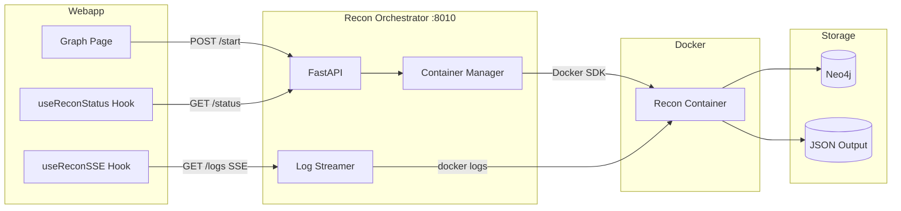

# Recon Orchestrator

FastAPI service for managing recon container lifecycle with real-time log streaming via Server-Sent Events (SSE).

## Overview

The Recon Orchestrator acts as a bridge between the webapp and the recon Docker containers. It provides:

- **Container Lifecycle Management** - Start, stop, and monitor recon containers
- **Real-time Log Streaming** - SSE-based log streaming to the frontend
- **Phase Detection** - Automatic detection of recon phases from log output
- **Status Tracking** - Track running/completed/error states per project

## Architecture



## Quick Start

```bash
# 1. Ensure Docker network exists
docker network create redamon-network

# 2. Build and start
cd recon_orchestrator
docker-compose build
docker-compose up -d

# 3. Verify health
curl http://localhost:8010/health
```

## API Endpoints

### Health Check

```
GET /health
```

Returns service health and running recon count.

```json
{
  "status": "healthy",
  "version": "1.0.0",
  "running_recons": 0
}
```

### Start Recon

```
POST /recon/{projectId}/start
Content-Type: application/json

{
  "user_id": "user-123",
  "webapp_api_url": "http://localhost:3000"
}
```

Starts a new recon container for the specified project. The container will:
1. Fetch project settings from `{webapp_api_url}/api/projects/{projectId}`
2. Run the recon pipeline
3. Update Neo4j with results

**Response:**
```json
{
  "project_id": "project-123",
  "status": "starting",
  "container_id": "abc123...",
  "started_at": "2024-01-15T10:30:00Z",
  "current_phase": null,
  "phase_number": null,
  "total_phases": 7
}
```

### Get Status

```
GET /recon/{projectId}/status
```

Returns current recon status for a project.

**Status Values:**
- `idle` - No recon running
- `starting` - Container starting
- `running` - Recon in progress
- `completed` - Recon finished successfully
- `error` - Recon failed
- `stopping` - Container being stopped

### Stream Logs (SSE)

```
GET /recon/{projectId}/logs
Accept: text/event-stream
```

Server-Sent Events stream of log lines. Events have the following format:

```
event: log
data: {"log": "Starting port scan...", "timestamp": "2024-01-15T10:30:00Z", "phase": "Port Scanning", "phaseNumber": 2, "isPhaseStart": false, "level": "info"}

event: complete
data: {"status": "completed", "completedAt": "2024-01-15T10:45:00Z", "error": null}
```

**Event Types:**
- `log` - Log line with phase detection
- `error` - Error message
- `complete` - Recon completion with final status

**Log Levels:**
- `info` - Normal log line
- `warning` - Warning message
- `error` - Error message
- `success` - Success message (phase completion, etc.)

### Stop Recon

```
POST /recon/{projectId}/stop
```

Gracefully stops a running recon container.

### List Running

```
GET /recon/running
```

Lists all currently running recon processes.

## TruffleHog Endpoints

The orchestrator manages TruffleHog secret scanner containers with the same lifecycle pattern as recon.

### Start TruffleHog Scan

```
POST /trufflehog/{projectId}/start
Content-Type: application/json

{
  "user_id": "user-123",
  "webapp_api_url": "http://localhost:3000"
}
```

Starts a TruffleHog secret scanner container for the specified project. Scans GitHub repositories for leaked credentials using detector-based verification and deep git history analysis.

### Get TruffleHog Status

```
GET /trufflehog/{projectId}/status
```

Returns current TruffleHog scan status for a project. Status values follow the same pattern as recon (`idle`, `starting`, `running`, `completed`, `error`, `stopping`, `paused`).

### Stop TruffleHog Scan

```
POST /trufflehog/{projectId}/stop
```

Gracefully stops a running TruffleHog scanner container.

### Pause TruffleHog Scan

```
POST /trufflehog/{projectId}/pause
```

Pauses a running TruffleHog scanner container.

### Resume TruffleHog Scan

```
POST /trufflehog/{projectId}/resume
```

Resumes a paused TruffleHog scanner container.

### Stream TruffleHog Logs (SSE)

```
GET /trufflehog/{projectId}/logs
Accept: text/event-stream
```

Server-Sent Events stream of TruffleHog log lines. Event format follows the same pattern as recon log streaming.

---

## Phase Detection

The orchestrator automatically detects recon phases from log output:

| Phase | Pattern | Description |
|-------|---------|-------------|
| 1 | `[Phase 1]`, `domain.*discovery` | Domain Discovery |
| 2 | `[Phase 2]`, `port.*scan` | Port Scanning |
| 3 | `[Phase 3]`, `http.*prob` | HTTP Probing |
| 4 | `[Phase 4]`, `resource.*enum` | Resource Enumeration |
| 4b | `JS Recon Scanner`, `JsRecon` | JS Recon (post-resource_enum) |
| 5 | `[Phase 5]`, `vuln.*scan` | Vulnerability Scanning |
| 6 | `[Phase 6]`, `mitre`, `cwe`, `capec` | MITRE Enrichment |
| 7 | `[Phase 7]`, `github.*secret` | GitHub Secret Hunt |

## Configuration

### Environment Variables

| Variable | Default | Description |
|----------|---------|-------------|
| `RECON_PATH` | `/app/recon` | Path to recon module |
| `RECON_IMAGE` | `redamon-recon:latest` | Docker image for recon |
| `ORCHESTRATOR_API_KEY` | (generated) | Required `X-Orchestrator-Key` on every route except `/health`; shared only with the webapp (auto-generated in `.env`) |

### Docker Compose

```yaml
services:
  recon-orchestrator:
    build: .
    container_name: redamon-recon-orchestrator
    ports:
      # Loopback-only bind: reachable from the host for debugging, but NOT from
      # bridge containers via the gateway IP — the worker cannot reach the
      # orchestration API.
      - "127.0.0.1:8010:8010"
    volumes:
      # Docker socket for container management
      - /var/run/docker.sock:/var/run/docker.sock
      # Recon module path
      - ../recon:/app/recon:ro
      # Output directory
      - ../recon/output:/app/recon/output:rw
    environment:
      - RECON_PATH=/app/recon
      - RECON_IMAGE=redamon-recon:latest
      # Orchestrator's OWN trusted webapp URL for credentialed pre-flight calls
      # (RoE / hard-guardrail) — never the client-supplied localhost:3000.
      - WEBAPP_API_URL=http://webapp:3000
      # Spawn the on-demand Ollama judge on the orchestrator's isolated network.
      - LOCAL_LLM_NETWORK=redamon-orchestrator-net
    networks:
      - orchestrator-net

networks:
  # Network isolation: the privileged orchestrator (Docker-socket holder) lives
  # on its OWN network, NOT on `redamon`. Only the webapp (multi-homed) and the
  # on-demand Ollama judge share it, so a compromised worker cannot reach the
  # orchestration API.
  orchestrator-net:
    name: redamon-orchestrator-net
    external: true
```

> **Security note.** The orchestrator holds the Docker socket and is the privileged
> component of the system. It is network-isolated from the worker (`kali-sandbox`):
> it sits on `redamon-orchestrator-net` (shared only with the webapp and the Ollama
> judge) rather than the shared `redamon` network, and its host port is bound to
> `127.0.0.1`, so a compromised worker cannot reach the orchestration API. On top of
> isolation, every route except `/health` requires an `X-Orchestrator-Key` header
> (held only by the webapp), so even a host-network peer that can reach
> `127.0.0.1:8010` cannot drive the API without the key. The recon and partial-recon
> containers it spawns do **not** receive the raw Docker socket — they mount a
> filtering broker socket that only permits creating the known tool containers
> (allowlisted images), so a compromised recon container cannot mount the host
> filesystem, run privileged, or escape to the host. The broker also enforces the
> mount **mode** (STRIDE T1/T2): a host path may be bound read-write only if it is
> under `ALLOWED_RW_PREFIXES` (default `/tmp/redamon`); source-tree binds must be
> `:ro`, so a compromised worker cannot overwrite `recon/main.py` or an Agent
> Skill on the host. Overridable via `DOCKER_BROKER_ALLOWED_RW_PREFIXES` /
> `ALLOWED_RW_VOLUMES`.

## Container Management

### Recon Container Setup

When starting a recon, the orchestrator:

1. Removes any existing container with the same name
2. Creates a new container with:
   - `network_mode: host` for scanning capabilities
   - `NET_RAW` capability only (for `masscan`/`nmap` SYN scans); recon/partial
     spawns run with `cap_drop: [ALL]` and NET_RAW re-added (STRIDE E6), plus the
     D1 `pids_limit`/`nano_cpus` caps; the container is **not** privileged, so it
     has no host-device or mount access
   - Filtering broker socket for nested (sibling) container execution, restricted
     to the known tool images. It is served on the `redamon_broker_socket` named
     volume (mounted at `/var/run/broker`) and selected via the `DOCKER_HOST`
     env var; a named volume is used so the unix socket is shareable across
     containers on both macOS (Docker Desktop) and native Linux
   - Environment variables: `PROJECT_ID`, `USER_ID`, `WEBAPP_API_URL`, and a
     scoped **`SCANNER_API_KEY`** (STRIDE S3/E6) injected INSTEAD of the master
     `INTERNAL_API_KEY` (falls back to the master key only pre-secret). It is
     accepted by the webapp on GET settings + GET projects and by the agent on
     `/llm/*`; it cannot mint admins or read llm-provider keys.

### Log Streaming Implementation

Logs are streamed using a thread-based approach:

1. A background thread reads logs synchronously from Docker SDK
2. Logs are pushed to an asyncio queue
3. The async generator yields log events from the queue
4. SSE events are sent to connected clients

This ensures the Docker SDK's synchronous `container.logs()` doesn't block the async event loop.

## Integration with Webapp

### Frontend Hooks

The webapp provides two hooks for recon integration:

**useReconStatus** - Polls status endpoint
```typescript
const { state, startRecon, stopRecon } = useReconStatus({
  projectId,
  enabled: true,
  onComplete: () => refetchGraph()
})
```

**useReconSSE** - Connects to SSE log stream
```typescript
const { logs, currentPhase, currentPhaseNumber } = useReconSSE({
  projectId,
  enabled: state?.status === 'running'
})
```

### API Routes

The webapp proxies requests to the orchestrator:

- `POST /api/recon/[projectId]/start` → `POST :8010/recon/{projectId}/start`
- `GET /api/recon/[projectId]/status` → `GET :8010/recon/{projectId}/status`
- `GET /api/recon/[projectId]/logs` → `GET :8010/recon/{projectId}/logs` (SSE)

Every orchestrator route except `/health` requires an `X-Orchestrator-Key` header
matching `ORCHESTRATOR_API_KEY`; requests without it get `401`. The webapp injects
the header server-side (via its `orchestratorFetch` helper) using a key shared only
between the webapp and the orchestrator, so the proxied calls carry it automatically.
The key is held only by those two services — the worker and spawned scan containers
never receive it.

## Troubleshooting

### Container Won't Start

1. Check Docker socket is accessible:
   ```bash
   docker exec redamon-recon-orchestrator docker ps
   ```

2. Verify recon image exists:
   ```bash
   docker images | grep redamon-recon
   ```

3. Check orchestrator logs:
   ```bash
   docker logs redamon-recon-orchestrator
   ```

### Logs Not Streaming

1. Verify SSE connection (all routes except `/health` need the key header):
   ```bash
   curl -N -H "X-Orchestrator-Key: $(grep '^ORCHESTRATOR_API_KEY=' .env | cut -d= -f2)" \
     http://localhost:8010/recon/{projectId}/logs
   ```

2. Check container is running:
   ```bash
   docker ps | grep redamon-recon
   ```

### Connection Refused from Webapp

The orchestrator is **not** on the shared `redamon` network — it lives on
`redamon-orchestrator-net`, and the webapp is multi-homed onto that network to
reach it. If the webapp cannot reach `recon-orchestrator:8010`, confirm the webapp
is attached to `redamon-orchestrator-net` (it must be on both `redamon` and
`redamon-orchestrator-net`). The host-published port is bound to `127.0.0.1`, so
other containers cannot reach the orchestrator via the host gateway — this is by
design (worker isolation); only the webapp's docker-DNS path is intended to work.

## Development

### Running Locally

```bash
# Install dependencies
pip install -r requirements.txt

# Run with hot reload
uvicorn api:app --host 0.0.0.0 --port 8010 --reload
```

### Testing Endpoints

Every route except `/health` requires the `X-Orchestrator-Key` header. Export the
key once from `.env`:

```bash
export KEY=$(grep '^ORCHESTRATOR_API_KEY=' .env | cut -d= -f2)

# Start recon
curl -X POST http://localhost:8010/recon/test-project/start \
  -H "X-Orchestrator-Key: $KEY" \
  -H "Content-Type: application/json" \
  -d '{"user_id": "user-1"}'

# Check status
curl -H "X-Orchestrator-Key: $KEY" http://localhost:8010/recon/test-project/status

# Stream logs (Ctrl+C to stop)
curl -N -H "X-Orchestrator-Key: $KEY" http://localhost:8010/recon/test-project/logs

# Stop recon
curl -X POST -H "X-Orchestrator-Key: $KEY" http://localhost:8010/recon/test-project/stop

# Health is the one exempt route (no key needed)
curl http://localhost:8010/health
```
