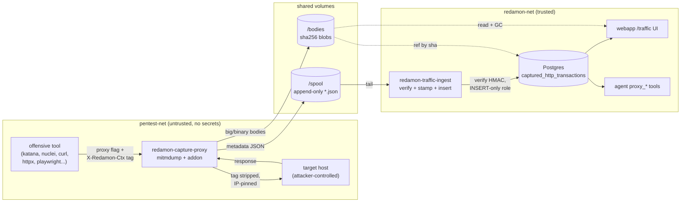
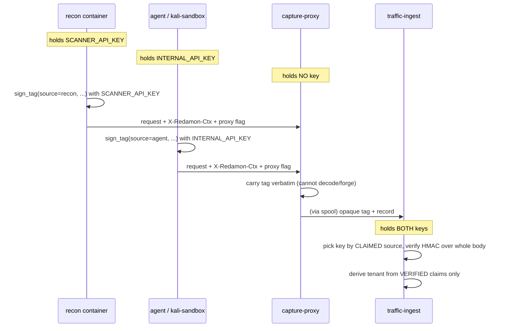
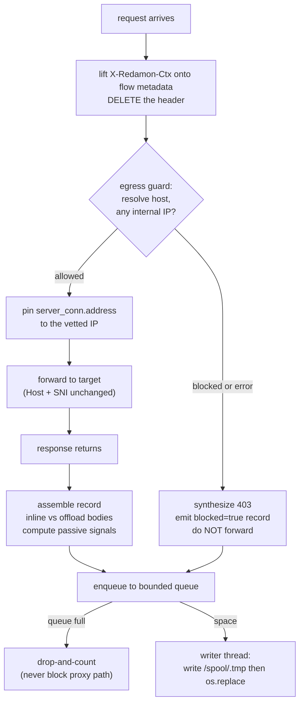
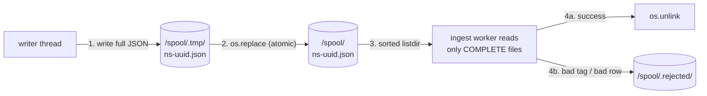
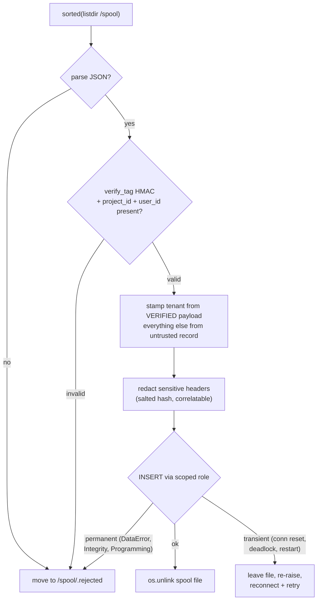
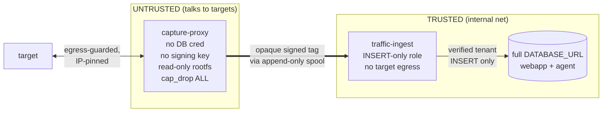
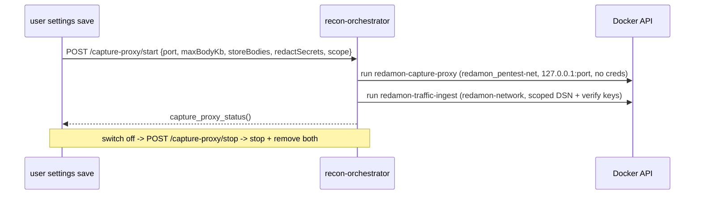
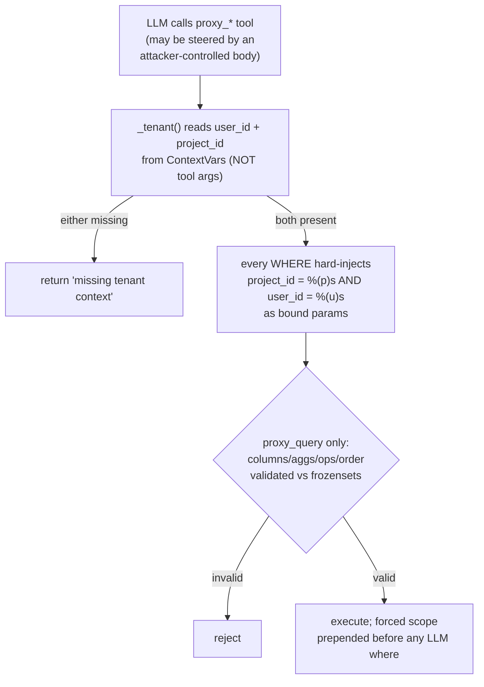
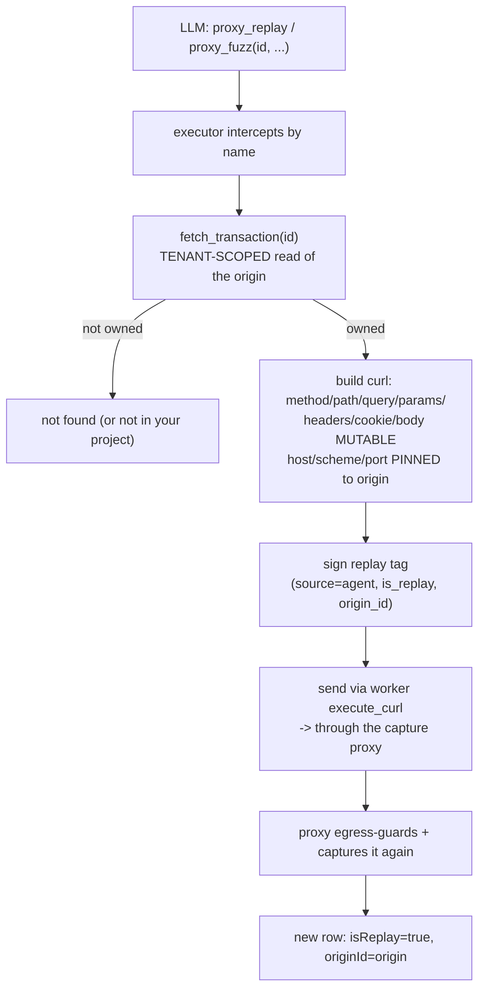
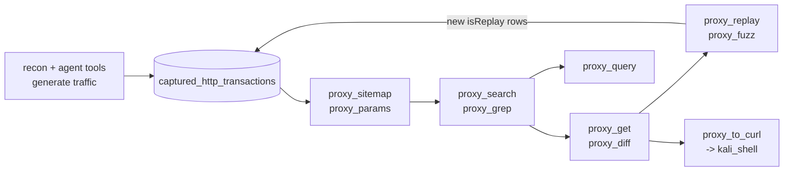

# HTTP Traffic Capture

RedAmon's built-in, engagement-scoped **proxy history**: a man-in-the-middle proxy
that sits between every offensive tool and its target, records the full
request/response of each HTTP transaction, tags it with *who* produced it
(project / user / run / tool), stores it in Postgres, and exposes it to both the
human (the `/traffic` UI) and the AI agent (read-only `proxy_*` tools).

Think of it as Burp Suite's HTTP history, except it is automatic (no manual proxy
config), attributed (every row knows which scan run and which agent session
created it), and queryable by the LLM itself.

> **Status:** shipped on branch `feat-remove_tor_integrate_mitmproxy`. Phase 0
> (direct httpx body ingest), Phase 1 (credential-free proxy + ingest), Phase 2
> (UI, export, delete, GC, body offload), part of Phase 3 (body search), plus
> agent-side replay + fuzz are live.
>
> Not yet wired (schema/comment stubs only): the `pg_trgm` full-text index (body
> search currently runs as `ILIKE`); the `labels`, `findingId` and `flowRef`
> columns (you cannot yet tag a transaction, link it to a finding, or do
> byte-perfect flow replay); and an automatic trigger for the `maintenance`
> retention job (the endpoint exists but nothing in the repo schedules it).

---

## Table of contents

- [1. The one idea to hold on to](#1-the-one-idea-to-hold-on-to)
- [2. Component inventory](#2-component-inventory)
- [3. End-to-end data flow](#3-end-to-end-data-flow)
- [4. Stage 1: Producers and the signed context tag](#4-stage-1-producers-and-the-signed-context-tag)
- [5. Stage 2: The capture proxy](#5-stage-2-the-capture-proxy)
- [6. Stage 3: The append-only spool](#6-stage-3-the-append-only-spool)
- [7. Stage 4: The ingest worker](#7-stage-4-the-ingest-worker)
- [8. Stage 5: Storage](#8-stage-5-storage)
- [9. Stage 6: Consumers](#9-stage-6-consumers)
- [10. Security model and trust boundaries](#10-security-model-and-trust-boundaries)
- [11. Configuration and lifecycle](#11-configuration-and-lifecycle)
- [12. Failure modes](#12-failure-modes)
- [13. Agent tools leveraging Traffic](#13-agent-tools-leveraging-traffic)

---

## 1. The one idea to hold on to

**Trust increases from left to right, and tenant identity is stamped at the trust
boundary.**

The proxy talks to attacker-controlled targets, so it is the *least-trusted*
component and holds nothing: no database credential, no signing key. Yet it
produces the data that everything downstream relies on. The whole architecture
exists to resolve that tension. Every unusual decision below (the spool hop, one
image running as two containers, the IP pin, drop-and-count backpressure, the
INSERT-only database role, inert body rendering, the constrained query builder)
is that single principle applied at one more layer.

Identity is carried across the untrusted zone as an opaque **signed capability**
(the `X-Redamon-Ctx` tag). The first component that can be trusted (the ingest
worker) verifies that signature and only then does `user_id` / `project_id`
become authoritative. Nothing a target ever touched is trusted to name a tenant.

---

## 2. Component inventory

| Component | Container | Network | Holds secret? | Source |
|---|---|---|---|---|
| Capture proxy | `redamon-capture-proxy` | `pentest-net` only | No | [`capture_proxy/capture_addon.py`](../capture_proxy/capture_addon.py) |
| Ingest worker | `redamon-traffic-ingest` | `redamon` only | Yes (scoped DB role) | [`capture_proxy/ingest_worker.py`](../capture_proxy/ingest_worker.py) |
| Tag primitive | (library, 3 copies) | n/a | key held by minters only | [`capture_proxy/redamon_ctx.py`](../capture_proxy/redamon_ctx.py) |
| Egress guard | (library, in proxy) | n/a | No | [`capture_proxy/egress.py`](../capture_proxy/egress.py) |
| Record shaping | (library, in proxy) | n/a | No | [`capture_proxy/capture_lib.py`](../capture_proxy/capture_lib.py) |
| Orchestrator control | `recon-orchestrator` | `redamon` + `pentest-net` | Yes | [`recon_orchestrator/container_manager.py:968`](../recon_orchestrator/container_manager.py#L968) |
| UI + API | `webapp` | `redamon` | Yes (full DSN) | [`webapp/src/app/traffic/`](../webapp/src/app/traffic/) |
| Agent tools | `agent` | `redamon` | Yes (full DSN) | [`agentic/traffic_tools.py`](../agentic/traffic_tools.py) |

**One image, two roles.** The proxy and the ingest worker are the *same*
`redamon-capture-proxy:latest` image ([`capture_proxy/Dockerfile`](../capture_proxy/Dockerfile)).
The role is chosen at runtime by `command` + `network` + `env`, not by the image.
Isolation therefore comes entirely from *placement*: the proxy is put on the
target-facing network with no credentials; the ingest worker is put on the
internal network with a scoped role. They share only code.

**Base image:** `python:3.12-slim` (Debian slim). Only two pip installs:
`mitmproxy~=11.1` (the interception engine, used by the proxy role) and
`psycopg[binary]~=3.2` (Postgres driver, used only by the ingest role and unusable
in the proxy since it has no route to Postgres and no credential). Everything else
is Python stdlib.

**Persistent volumes:**

- `redamon_capture_spool` -> `/spool` : the append-only handoff between proxy and ingest.
- `redamon_capture_bodies` -> `/bodies` : content-addressed body blob store (shared with the webapp for read + GC).
- `redamon_capture_ca` -> `/ca` : the mitmproxy CA (a forge-anything private key, isolated to the proxy).

---

## 3. End-to-end data flow



The trusted zone is the only place `user_id` / `project_id` are treated as true.
Data crosses from the untrusted zone to the trusted zone through the spool,
carrying the tenant claim in a signed but as-yet-unverified form.

---

## 4. Stage 1: Producers and the signed context tag

Capture is **off by default** and controlled by a **two-level gate**
([`schema.prisma:129-142`](../webapp/prisma/schema.prisma#L129-L142)):

1. **Global capability switch** `UserSettings.captureProxyEnabled` (operator-level).
   Flipping this is what actually spawns or stops the proxy + ingest containers
   via the orchestrator. If it is off, no capture container runs at all.
2. **Per-project routing gate** `Project.captureProxyEnabled` (the "HTTP Traffic
   Capture" toggle in the project form,
   [`TrafficCaptureSection.tsx`](../webapp/src/components/projects/ProjectForm/sections/TrafficCaptureSection.tsx)).
   This decides whether *that project's* traffic is routed through the running
   proxy.

Both must be on for a project to be captured. A third knob,
`UserSettings.captureProxyScope` (`recon | agent | both`, default `both`),
selects which producers route: recon tools, agent tools, or both.

When capture is active, two independent minters attach the tag, each holding a
*different* signing key.

### The tag

`X-Redamon-Ctx` is a compact, URL-safe, HMAC-SHA256 signed token
([`redamon_ctx.py:60`](../capture_proxy/redamon_ctx.py#L60)). Format:
`<b64url(canonical-json)>.<b64url(hmac)>`. The JSON is canonical (sorted keys,
compact separators) so signer and verifier agree byte-for-byte, and only a
whitelist of fields is carried so a caller cannot smuggle extra fields past the
signature:

```
source, project_id, user_id, run_id, session_id, tool, phase, step, member_id
```

Valid `source` values are exactly `{"recon", "agent"}`.

### Two minters, two keys, one verifier



Because `source` lives *inside* the signed body and the verifier selects its key
by that claimed source, an attacker who holds neither key cannot forge a tag for
either source. The proxy holds no key at all, so it can neither read nor forge the
tag; it only carries it.

**Recon minter** ([`recon/helpers/proxy_routing.py:104`](../recon/helpers/proxy_routing.py#L104)):
`get_capture_routing(tool, phase)` signs with `SCANNER_API_KEY`, `source="recon"`,
carrying project/user/run IDs, tool, phase. Initialized once per run via
`proxy_routing.configure(settings)`.

**Agent minter** ([`agentic/tools.py:1780`](../agentic/tools.py#L1780)):
`_build_redamon_ctx(tool_name)` signs with `INTERNAL_API_KEY`, `source="agent"`,
pulling project / user / session from ContextVars (never from LLM arguments). The
tag is injected as a stripped `_redamon_ctx` kwarg the model never sees.

### How each tool is pointed at the proxy

The proxy flag and the `-H X-Redamon-Ctx` header are always added **in the same
branch of code**. This is a deliberate leak-guard: the tag can never be attached
on the direct (non-proxy) path, so internal identifiers cannot leak to a target.

| Tool | Mechanism | Reaches proxy at |
|---|---|---|
| katana | `-proxy` + `-H` | `127.0.0.1:8888` (recon runs `--net=host`) |
| nuclei | `-proxy` + `-H` | same |
| ffuf | `-x` + `-H` | same |
| hakrawler | `-proxy` + `-H` | same |
| kiterunner | `--proxy` + `-H` | same |
| arjun | `HTTP_PROXY` env + `--headers` | same |
| agent curl | `-x` + `-H` | `redamon-capture-proxy:8888` (DNS) |
| agent httpx | `-proxy` + `-H` | same |
| agent playwright | launch `proxy={server}` + `extra_http_headers` (both wrapped and self-contained scripts) | same |
| agent nuclei | `-proxy` + `-H` | same |
| agent katana | `-proxy` + `-H` | same |
| agent ffuf | `-x` + `-H` | same |
| agent arjun | `HTTP_PROXY` env + `--headers` | same |
| agent wpscan | `--proxy` + `--headers` | same |

Eight agent tools are routed: `execute_curl`, `execute_httpx`,
`execute_playwright`, plus the HTTP recon/exploit tools `execute_nuclei`,
`execute_katana`, `execute_ffuf`, `execute_arjun`, `execute_wpscan`
(`_CAPTURE_ROUTED_TOOLS`, [`agentic/tools.py:63`](../agentic/tools.py#L63)). These
mirror the recon pipeline so the agent's own crawl/fuzz/scan traffic is captured,
searchable, and replayable. For the `-H`-repeatable tools (nuclei/katana/ffuf) the
flag + header are appended like curl/httpx; `wpscan`/`arjun` merge the tag into a
single `--headers` value (arjun routes via `HTTP(S)_PROXY` env since it is
requests-based). Everything else the agent runs (subfinder, naabu, web_search,
query_graph, and so on) goes direct with no tag, by design.

**Inherent blind spot.** `kali_shell` (arbitrary `bash -c`), `execute_code`
(arbitrary interpreters), and `metasploit_console` HTTP modules run
attacker-defined commands, so no per-tool flag can force them through the proxy.
Closing this needs container-level transparent egress on the kali-sandbox plus a
default-identity tag, tracked as future hardening. Recon-side Python probes
(`security_checks`, cache-scan/WCVS, GraphQL, JS/AI-surface fetchers) and the
`ai_attack_surface_scan` container are likewise not yet routed.

### The Phase-0 side door

One producer bypasses the proxy entirely: the recon Python `httpx` probe
([`recon/helpers/traffic_capture.py`](../recon/helpers/traffic_capture.py)). It
POSTs full transactions straight to the webapp ingest endpoint
`POST /api/traffic/{project_id}/ingest` with an `X-Internal-Key` header, and the
webapp stamps the tenant. This is the original Phase-0 path that retained httpx
bodies (otherwise discarded after fingerprinting) before the proxy existed. It
mints no `X-Redamon-Ctx` tag. So there are two ingest routes into the same table:
the proxy/spool path and this direct-POST path.

---

## 5. Stage 2: The capture proxy

`mitmdump -s capture_addon.py`, on `pentest-net` only, so it structurally cannot
reach Postgres, Neo4j, the agent, or the webapp. It runs with
`connection_strategy=lazy` (so the upstream connection is deferred until after the
request hook, which is what makes the IP pin below effective) and
`stream_large_bodies=5m` (bounds memory on huge responses).



### Request hook

1. **Strip the tag.** `headers.pop("X-Redamon-Ctx")` lifts the tag onto flow
   metadata and deletes the header so it never reaches the target
   ([`capture_addon.py:92`](../capture_proxy/capture_addon.py#L92)).
2. **Egress guard** ([`egress.py`](../capture_proxy/egress.py)). A new proxy is a
   new egress path, so it must not become an SSRF pivot into RedAmon's internal
   network. The guard resolves the hostname and refuses if *any* resolved A/AAAA
   address is internal: RFC1918, loopback, link-local, CGNAT `100.64.0.0/10`,
   reserved, multicast, unspecified, IPv4-mapped IPv6, or a configured blocked IP.
   A name resolving to one public + one internal address is treated as hostile.
   Every error path fails **closed** (unparseable IP, unresolvable name, bad IDNA
   label all block).

   **Configurable per condition.** Each block condition is an independent toggle
   in an [`EgressPolicy`](../capture_proxy/egress.py), surfaced in *Global
   Settings > TrafficMind > Egress guard* and injected at proxy spawn as
   `CAPTURE_EGRESS_*` env (`policy_from_env`). **Every check defaults to block**,
   so `EgressPolicy()` reproduces the always-on guard and every existing caller /
   test is unchanged. An operator can relax one class, most usefully
   `block_private`, to let the proxy reach an internal / lab target on a private
   Docker network, *without* weakening the others, because each address class has
   its own independent check (relaxing RFC1918 does not un-block `127.0.0.1`, which
   is still caught by `block_loopback`). Two safety invariants hold regardless of
   the toggles: (a) the explicit `extra_blocked` IP denylist (`CAPTURE_BLOCKED_IPS`,
   RedAmon's own service IPs) is **never** policy-gated, so unblocking private
   targets cannot pivot into RedAmon itself; and (b) `check_egress` returns
   `allowed=True` only with a concrete pinned IP, so an empty / unresolvable host
   is never forwarded even if its toggle is off (the toggle only relabels the
   refusal). The `fail_closed_on_error` toggle governs the guard-internal-error
   path: on (default) an error blocks; off makes it fail-open (forward without
   vetting); exposed for completeness, but dangerous.
3. **IP pin.** On allow it sets `flow.server_conn.address` to the exact vetted IP,
   so mitmproxy does not re-resolve and land on a rebound internal address between
   the guard check and the connection (a DNS-rebinding TOCTOU). Only the
   connection address is pinned, not `request.host`, so the Host header and TLS
   SNI keep the original hostname and vhosts / HTTPS still work.
4. **Blocked requests** get a synthetic `403` and a `blocked=true` spool record.
   The attempt is still recorded, for the scope audit.

### Response hook

Assemble the record, decide inline vs offload per body, compute passive signals,
enqueue. Wrapped in a blanket exception handler that logs but never breaks the
proxy path.

**Body policy** ([`capture_lib.py:101`](../capture_proxy/capture_lib.py#L101)). Each
body is routed to exactly one destination: **inline** (Postgres column, agent +
human readable), **disk** (offload to `/bodies/<sha256>`, human/UI readable only),
or **meta** (drop bytes, keep only size + sha256). The routing is a per
content-type **family** policy, not a flat text/binary split:

1. Master `store_bodies` off, empty body, or a per-direction toggle
   (`CAPTURE_STORE_REQ_BODIES` / `CAPTURE_STORE_RESP_BODIES`) off -> **meta**.
2. `classify_family` maps the `Content-Type` (with a URL filename-extension
   fallback that rescues octet-stream-mislabeled files, e.g. a `.woff2` served as
   `application/octet-stream`) to one of: `text json script image font video
   audio document archive binary other`.
3. The family's **policy** (`CAPTURE_BODY_RULES`, a JSON `family->policy` map
   merged over the shipped **Recommended** defaults) decides:
   - `auto` -> size-based: text-like family and size <= inline cap
     (`CAPTURE_PROXY_MAX_BODY_KB`, default 64 KB) -> **inline**, else **disk**.
   - `inline` -> force DB (falls back to disk over the inline cap).
   - `disk` -> always offload.
   - `meta` -> drop bytes, keep size + sha256.
4. A hard ceiling `CAPTURE_MAX_STORE_MB` (default 5 MB, 0 = unlimited) overrides
   `disk`/`inline` to **meta** for any oversized body.

Recommended defaults: text/json/script `auto`; image/font/video/audio `meta`
(render noise dropped); document/archive/binary `disk` (leak-worthy downloads
kept). Offload is content-addressed, so identical bodies dedup by sha256. The
`CAPTURE_PROXY_MAX_BODY_KB` cap is a DB-vs-disk **routing** threshold, never a
size limit — the only knob that *drops* by size is `CAPTURE_MAX_STORE_MB`.

**Passive signals**, computed for free on every response
([`capture_lib.py:85`](../capture_proxy/capture_lib.py#L85)): `hadAuth`,
`hasSetCookie`, missing security headers, cookie-flag issues (missing
HttpOnly / Secure / SameSite), and `reflectedParams` (any query or body param value
of at least 4 characters appearing verbatim in the response body, a lead for XSS /
SSTI / open-redirect).

### Backpressure

A bounded `queue.Queue` (default 2000, `CAPTURE_QUEUE_MAX`) drained by a single
daemon writer thread. If the queue fills, the proxy **drops and counts** rather
than blocking the data path. Capture is best-effort: it must never slow a scan.

### Hardening

Non-root user (uid 10001), `read_only` root filesystem, `cap_drop: [ALL]`,
`mem_limit` 384m, `pids_limit` 256. Privilege escalation is blocked by stripping
setuid / setgid bits from every binary in the image
([`Dockerfile:19`](../capture_proxy/Dockerfile#L19)) rather than the
`no-new-privileges` flag, which breaks `execve` for non-root users on this
project's snap-Docker / AppArmor hosts. The mitmproxy CA lives on its own volume
via `--set confdir=/ca` and its private key never leaves that volume.

---

## 6. Stage 3: The append-only spool

The spool is not a single appended file. It is a **directory with one atomically
renamed file per flow**, which keeps it concurrency-safe under many mitmproxy
coroutines and effectively append-only.



The write ([`capture_addon.py:226`](../capture_proxy/capture_addon.py#L226))
writes to `/spool/.tmp/` then `os.replace()` into `/spool/`. The rename is atomic
within the filesystem, so the ingest worker never sees a half-written record. The
filename is `time_ns()`-prefixed so a plain `sorted(os.listdir())` yields roughly
chronological processing order. Large / binary bodies are written to `/bodies`
with the same tmp-then-`os.replace` pattern and an existence check for dedup.

---

## 7. Stage 4: The ingest worker

[`ingest_worker.py`](../capture_proxy/ingest_worker.py), on `redamon` only (no
target egress at all). It is the *only* capture component that holds a database
credential, and that credential is a role which can do exactly one thing: INSERT
into one table.



Key properties:

- **Verification** ([`redamon_ctx.py:74`](../capture_proxy/redamon_ctx.py#L74)):
  read `source` from the unverified body only to *select* the key, then
  `hmac.compare_digest` over the whole body (constant-time), then re-canonicalize
  and compare to reject any smuggled extra fields.
- **Tenant stamping** ([`ingest_worker.py:83`](../capture_proxy/ingest_worker.py#L83)):
  `project_id`, `user_id`, `source` and attribution come from the *verified*
  payload. Everything else (method, host, bodies, signals) comes from the
  untrusted proxy record. The primary key `id` is generated here because Prisma's
  cuid default is client-side.
- **Redaction** ([`ingest_worker.py:53`](../capture_proxy/ingest_worker.py#L53)):
  when `CAPTURE_PROXY_REDACT_SECRETS` is on, sensitive headers (authorization,
  cookie, set-cookie, x-api-key, x-auth-token, proxy-authorization) are replaced
  with `[redacted:<salted-hash-prefix>]`, so identical secrets still correlate
  without storing plaintext.
- **Retry discipline**: transient database errors leave the spool file in place
  and re-raise, so the outer loop reconnects and retries. A validly captured
  record is never discarded. Only permanent constraint errors get rejected.

### The scoped role

[`capture_proxy/sql/001_traffic_ingest_role.sql`](../capture_proxy/sql/001_traffic_ingest_role.sql)
creates the `traffic_ingest` login role and grants it exactly:

```sql
REVOKE ALL ON ALL TABLES IN SCHEMA public FROM traffic_ingest;
GRANT USAGE ON SCHEMA public TO traffic_ingest;              -- just to name the table
GRANT INSERT ON TABLE captured_http_transactions TO traffic_ingest;
REVOKE SELECT ON captured_http_transactions FROM traffic_ingest;  -- never read back
```

INSERT on one table, no SELECT, no other tables, no DDL. Even a fully compromised
ingest worker can only append non-readable, purgeable rows: it can neither
exfiltrate another tenant's data nor tamper with existing rows.

### Documented residual

The tag authenticates the tenant claims but has no nonce, no expiry and no binding
to request content. A fully compromised proxy therefore sees valid tags for the
tenants it proxies and could replay one to attribute *fabricated* rows to that
tenant. This is bounded by the INSERT-only role (forged rows are non-readable,
purgeable, and land only in a tenant whose traffic the proxy already saw) and is
the accepted price of keeping the proxy credential-free. Closing it fully would
need a content digest plus a short expiry in the tag (a future hardening).

---

## 8. Stage 5: Storage

Table `captured_http_transactions`, Prisma-owned
([`schema.prisma:1052`](../webapp/prisma/schema.prisma#L1052)) so both the ingest
worker and the webapp agree on the shape. The ingest worker references the
snake_case column names directly.

Shape (grouped):

- **Tenancy:** `projectId`, `userId` (both `onDelete: Cascade`).
- **Attribution:** `source` (recon|agent), `runId`, `sessionId`, `memberId`,
  `tool`, `phase`, `stepId`.
- **Request:** `method`, `scheme`, `host`, `port`, `path`, `query`, `reqHeaders`
  (Json), `reqBody` (inline text if small), `reqBodyRef` (sha256 -> disk),
  `reqBodySize`, `reqContentType`, `reqBodySha256`.
- **Response:** `statusCode`, `respHeaders`, `respBody`, `respBodyRef`,
  `respBodySize`, `respContentType`, `respBodySha256`, `responseTimeMs`.
- **Network:** `targetIp`, `httpVersion`, `isTls`, `tlsVersion`.
- **Replay lineage:** `isReplay`, `originId`. Populated when the agent replays or
  fuzzes a request (see section 13): the replayed transaction is re-captured with
  `isReplay = true` and `originId` pointing at the source transaction, both
  stamped from the *verified* replay tag.
- **Scope / safety:** `inScope`, `blocked`, `errorText`.
- **Secret handling:** `redacted`, `redactedFields`.
- **Passive signals:** `hasSetCookie`, `hadAuth`, `reflectedParams`,
  `securityHeadersMissing`, `cookieFlagIssues` (computed by the proxy only when
  `captureProxyPassiveDetect` is on).
- **Timestamps:** `startedAt`, `createdAt`.
- **Reserved (declared but not yet wired):** `labels`, `findingId`, `flowRef`. No
  code writes or reads these today, so transaction tagging, finding links, and
  byte-perfect flow replay are not implemented; current replay rebuilds the
  request from the stored fields.

**Indexes:** ten composite btree indexes, every one prefixed by `projectId`
(`[projectId,userId]`, `[projectId,createdAt]`, `[projectId,source]`,
`[projectId,host]`, `[projectId,sessionId]`, `[projectId,runId]`,
`[projectId,tool]`, `[projectId,statusCode]`, `[projectId,isReplay]`,
`[projectId,inScope]`). There is no `pg_trgm` / tsvector index yet: body and URL
search currently run as `ILIKE` / `contains` with no supporting index.

Bodies are stored inline when small, otherwise offloaded to the content-addressed
blob store at `CAPTURE_BODIES_DIR` and referenced by sha256. Blob filenames are
validated against `^[0-9a-f]{64}$` to block path traversal
([`captureBodies.ts`](../webapp/src/lib/captureBodies.ts)).

---

## 9. Stage 6: Consumers

### Human: the `/traffic` UI

[`webapp/src/app/traffic/page.tsx`](../webapp/src/app/traffic/page.tsx). A
server-paginated, Burp-style table. Columns: Time, Source (recon/agent badge),
Tool, Method, Host, Path, Status (colored by class, "BLK" if blocked), Length,
response Time, Flags (cookie / reflect / replay / out-of-scope). Filters: date
range, source, tool, host, method, status class, run, URL search (`q`), body
search (`bodyq`), set-cookie, 5xx-only. A detail drawer shows full request /
response with a client-side "Copy as curl" (`toCurl` in the page, distinct from
the agent's `proxy_to_curl` tool). **Response bodies are rendered as inert text,
never HTML**, because they are attacker-controlled.

### API routes

All routes under [`webapp/src/app/api/traffic/`](../webapp/src/app/api/traffic/)
enforce `requireEffectiveUser` + `requireProjectAccess`. Tenant fields always come
from the session / route, never the client.

- **`GET [projectId]`** : paginated filtered list. Summary columns only, bodies
  never in the list. Whitelisted `orderBy`, max page size 200. Shared predicate
  `buildTrafficWhere`.
- **`GET [projectId]/[id]`** : one full transaction incl. headers and bodies.
  `findFirst({id, projectId, ownerScope})`, so a cross-tenant id returns 404
  (anti-enumeration). Offloaded bodies resolved only through the owned row.
- **`GET [projectId]/export`** : streams the current filtered set as CSV or JSON,
  keyset-paginated, 50k-row cap with a truncation marker, CSV formula-injection
  guard.
- **`GET [projectId]/facets`** : distinct tool / host / runId / sessionId for the
  filter dropdowns.
- **`DELETE [projectId]`** : batch delete by ids or by filter (reusing
  `buildTrafficWhere` so "delete all matching" equals the current view). Collects
  the doomed rows' body refs, deletes, then ref-counted GC of orphaned blobs, then
  an audit log line.
- **`POST maintenance`** : internal-only (`isInternalRequest`). Three phases:
  per-owner retention purge using `UserSettings.captureProxyRetentionDays`
  (default 14, `<= 0` keeps forever), per-project quota eviction of the oldest
  beyond the `CAPTURE_PROXY_MAX_ROWS_PER_PROJECT` env (default 200000), and a full
  orphan-body sweep. **Caveat: nothing in the repo schedules this.** The endpoint
  is written to be driven by a cron or the orchestrator, but no cron, timer, or
  caller currently POSTs to it. Until one is wired, retention and quota eviction
  do not run and the corpus grows unbounded.
- **`POST [projectId]/ingest`** : the Phase-0 producer side (writer, see 4.4).

Body GC ([`captureBodies.ts`](../webapp/src/lib/captureBodies.ts)) is ref-counted
across all tenants with a 5-minute grace window to avoid a TOCTOU against in-flight
ingest. Blobs are served only via an owned row, never by raw sha path.

### Agent: the `proxy_*` tools

Covered in full in [section 13](#13-agent-tools-leveraging-traffic).

---

## 10. Security model and trust boundaries



Boundary-by-boundary:

1. **Proxy has no credentials and no key.** It cannot read the tenant name, forge
   a tag, reach Postgres, or read another tenant's traffic. A full proxy
   compromise yields only forged INSERT-only rows in already-seen tenants.
2. **The tag is a signed capability.** Two minters, two keys, one verifier;
   `source` inside the signed body; canonical JSON; constant-time compare. Forgery
   requires a key the proxy and targets never hold.
3. **Ingest is the trust boundary.** Tenant identity becomes authoritative only
   after HMAC verification, and even ingest can only INSERT one table.
4. **Egress guard + IP pin** stop the proxy from being an SSRF pivot or a
   DNS-rebinding hole into the internal network.
5. **Attacker-controlled bodies stay inert.** The UI renders bodies as text, and
   the agent tools never build raw SQL from body content (see section 13).
6. **Least-privilege containers.** Non-root, read-only rootfs, dropped caps,
   memory and pid limits on both the proxy and the ingest worker.

### Known residuals

- **Tag replay** by a fully compromised proxy (bounded by INSERT-only, see 7).
- **Spool is a shared read-write volume.** A compromised proxy could delete or
  overwrite spooled records before ingest reads them (lost capture data), a weaker
  property than the "append-only" name implies. The residual is lost evidence, not
  forged readable rows.
- **`/bodies` is chmod 0777** so the differently-uid'd webapp can read and GC it.
  Defensible (internal volume, never served by raw path) but a shared-gid approach
  would be tighter.

---

## 11. Configuration and lifecycle

### The toggle

The **global** switch `UserSettings.captureProxyEnabled` drives container
lifecycle. The trigger lives in the user-settings write
([`webapp/src/app/api/users/[id]/settings/route.ts:221`](../webapp/src/app/api/users/[id]/settings/route.ts#L221)),
not in project save. It calls the orchestrator when the switch flips, or when a
runtime knob changes while it is already enabled.



The orchestrator endpoints are `/capture-proxy/{start,stop,status}`
([`api.py:400`](../recon_orchestrator/api.py#L400)); the spawn logic is
[`container_manager.py:968`](../recon_orchestrator/container_manager.py#L968). It
spawns the pair idempotently. The image is taken from trusted orchestrator env
only and is never overridable from the UI, so the operator toggle can never spawn
an arbitrary image. The proxy is published on `127.0.0.1:<port>` so host-net recon
containers reach it; the ingest worker gets the scoped `TRAFFIC_INGEST_DATABASE_URL`
plus both verification keys. The settings write is best-effort (wrapped in
try/catch) so a save never fails just because the orchestrator is down.

Exact networks: the proxy joins `redamon_pentest-net` only
(`_CAPTURE_PROXY_NETWORK`), the ingest worker joins `redamon-network` only
(`_CAPTURE_INGEST_NETWORK`,
[`container_manager.py:942-943`](../recon_orchestrator/container_manager.py#L942-L943)).

There is also a static `capture` compose profile
([`docker-compose.yml:889`](../docker-compose.yml#L889)) that defines the same two
services for a manual `docker compose --profile capture up`.

### Settings (database fields)

These are per-owner / per-project settings, not env vars. The container-shaping
ones are pushed to the orchestrator on the settings save.

| Field | Model | Default | Purpose |
|---|---|---|---|
| `captureProxyEnabled` | UserSettings | false | global switch; spawns/stops containers |
| `captureProxyEnabled` | Project | false | per-project routing gate |
| `captureProxyScope` | UserSettings | `both` | which producers route (recon\|agent\|both) |
| `captureProxyPort` | UserSettings | 8888 | proxy listen + publish port |
| `captureProxyStoreBodies` | UserSettings | true | master switch: store bodies at all |
| `captureProxyStoreReqBodies` | UserSettings | true | store request bodies (direction gate) |
| `captureProxyStoreRespBodies` | UserSettings | true | store response bodies (direction gate) |
| `captureProxyMaxBodyKb` | UserSettings | 64 | inline (DB-vs-disk) text routing threshold |
| `captureProxyMaxStoreMb` | UserSettings | 5 | hard drop ceiling in MB (0 = unlimited) |
| `captureProxyBodyRules` | UserSettings | `{}` | per-family policy map (auto\|inline\|disk\|meta); `{}` = Recommended defaults |
| `captureProxyRedactSecrets` | UserSettings | true | redact sensitive headers |
| `captureProxyPassiveDetect` | UserSettings | true | compute passive signals |
| `captureProxyRetentionDays` | UserSettings | 14 | maintenance retention (`<= 0` = forever) |
| `captureEgressBlockEmptyHost` | UserSettings | true | egress guard: block empty Host |
| `captureEgressBlockHardGuardrail` | UserSettings | true | egress guard: block `.gov/.mil/.edu/.int` + denylist |
| `captureEgressFailClosed` | UserSettings | true | egress guard: fail closed on guard error (off = fail-open, dangerous) |
| `captureEgressBlockUnresolvable` | UserSettings | true | egress guard: block unresolvable / bad-IDNA hosts |
| `captureEgressBlockPrivate` | UserSettings | true | egress guard: block RFC1918 + IPv6 ULA (off = reach private/lab targets) |
| `captureEgressBlockLoopback` | UserSettings | true | egress guard: block `127.0.0.0/8`, `::1` |
| `captureEgressBlockLinkLocal` | UserSettings | true | egress guard: block `169.254.0.0/16` (incl. metadata), `fe80::/10` |
| `captureEgressBlockCgnat` | UserSettings | true | egress guard: block `100.64.0.0/10` |
| `captureEgressBlockReserved` | UserSettings | true | egress guard: block IANA-reserved ranges |
| `captureEgressBlockMulticast` | UserSettings | true | egress guard: block `224.0.0.0/4`, `ff00::/8` |
| `captureEgressBlockUnspecified` | UserSettings | true | egress guard: block `0.0.0.0`, `::` |

The eleven `captureEgress*` fields are pushed to the orchestrator on save (as the
`egress*` keys of `CaptureProxyConfig`) and injected into the spawned proxy as the
`CAPTURE_EGRESS_*` env below. All default **true** (block).

### Environment variables

| Variable | Default | Applies to | Purpose |
|---|---|---|---|
| `CAPTURE_PROXY_ENABLED` | false | producers | routing gate (derived from `Project.captureProxyEnabled`) |
| `CAPTURE_PROXY_IMAGE` | `redamon-capture-proxy:latest` | orchestrator | image (trusted env only) |
| `CAPTURE_PROXY_MAX_BODY_KB` | 64 | proxy | inline (DB-vs-disk) text routing threshold |
| `CAPTURE_PROXY_STORE_BODIES` | true | proxy | master switch: store bodies at all |
| `CAPTURE_STORE_REQ_BODIES` | true | proxy | store request bodies (direction gate) |
| `CAPTURE_STORE_RESP_BODIES` | true | proxy | store response bodies (direction gate) |
| `CAPTURE_MAX_STORE_MB` | 5 | proxy | hard drop ceiling in MB (0 = unlimited) |
| `CAPTURE_BODY_RULES` | (empty) | proxy | JSON family->policy map; empty = Recommended defaults |
| `CAPTURE_PROXY_REDACT_SECRETS` | true | ingest | redact sensitive headers |
| `CAPTURE_REDACT_SALT` | `redamon-capture` | ingest | salt for redaction hash |
| `CAPTURE_BLOCKED_IPS` | (empty) | proxy | extra egress denylist (**always enforced**, never policy-gated) |
| `CAPTURE_EGRESS_BLOCK_EMPTY_HOST` | true | proxy | egress guard: block empty Host |
| `CAPTURE_EGRESS_BLOCK_HARD_GUARDRAIL` | true | proxy | egress guard: block `.gov/.mil/.edu/.int` + denylist |
| `CAPTURE_EGRESS_FAIL_CLOSED` | true | proxy | egress guard: fail closed on guard error (false = fail-open) |
| `CAPTURE_EGRESS_BLOCK_UNRESOLVABLE` | true | proxy | egress guard: block unresolvable / bad-IDNA |
| `CAPTURE_EGRESS_BLOCK_PRIVATE` | true | proxy | egress guard: block RFC1918 + IPv6 ULA |
| `CAPTURE_EGRESS_BLOCK_LOOPBACK` | true | proxy | egress guard: block loopback |
| `CAPTURE_EGRESS_BLOCK_LINK_LOCAL` | true | proxy | egress guard: block link-local (incl. metadata) |
| `CAPTURE_EGRESS_BLOCK_CGNAT` | true | proxy | egress guard: block CGNAT `100.64/10` |
| `CAPTURE_EGRESS_BLOCK_RESERVED` | true | proxy | egress guard: block reserved ranges |
| `CAPTURE_EGRESS_BLOCK_MULTICAST` | true | proxy | egress guard: block multicast |
| `CAPTURE_EGRESS_BLOCK_UNSPECIFIED` | true | proxy | egress guard: block `0.0.0.0` / `::` |
| `CAPTURE_QUEUE_MAX` | 2000 | proxy | backpressure queue size |
| `CAPTURE_PROXY_MAX_ROWS_PER_PROJECT` | 200000 | maintenance | per-project quota eviction |
| `TRAFFIC_INGEST_DATABASE_URL` | (empty) | ingest | scoped INSERT-only DSN |
| `SCANNER_API_KEY` | changeme | recon minter + ingest verify | recon-source key |
| `INTERNAL_API_KEY` | (env) | agent minter + ingest verify | agent-source key |
| `CAPTURE_PROXY_MEM` | 384m | proxy | proxy memory limit |
| `TRAFFIC_INGEST_MEM` | 256m | ingest | ingest memory limit |

There is no `CAPTURE_PROXY_RETENTION_DAYS` or `CAPTURE_PROXY_SCOPE` env var:
retention and scope are the database fields above.

### First-time setup

1. `docker compose exec webapp npx prisma db push` to create the table.
2. Apply the scoped role once:
   `docker compose exec -T postgres psql -U redamon -d redamon -v role_password="'<secret>'" -f - < capture_proxy/sql/001_traffic_ingest_role.sql`
3. Set `TRAFFIC_INGEST_DATABASE_URL=postgresql://traffic_ingest:<secret>@postgres:5432/redamon`.
4. Build the image: `docker compose --profile capture build capture-proxy`.
5. Enable the per-project toggle.

---

## 12. Failure modes

- **Proxy unreachable while capture is enabled:** both recon and agent producers
  TCP-probe reachability (recon with a 15s re-probe TTL). If enabled but
  unreachable, the tool runs **direct, with no tag**, and logs it. The consequence
  is a *silent evidence gap*, never a scan failure. On this direct path the tag
  header is provably never attached (flag + header are always added together).
- **Spool backs up:** the proxy drops and counts; the proxy data path never
  blocks.
- **Bad / missing / forged tag:** the ingest worker moves the record to
  `/spool/.rejected`; it is never inserted.
- **Transient DB error:** ingest leaves the spool file and retries; no capture is
  lost.
- **Permanent constraint error:** ingest rejects that one record and continues.
- **Body offloaded but not readable agent-side:** `proxy_get` returns
  `[offloaded to disk - not available agent-side]` rather than failing.

---

## 13. Agent tools leveraging Traffic

The agent works the capture corpus through **ten** tools in
[`agentic/traffic_tools.py`](../agentic/traffic_tools.py), modeled on
`query_graph`: **eight read-only** analysis tools
(`build_traffic_read_tools()`, [`traffic_tools.py:573`](../agentic/traffic_tools.py#L573))
and **two active, DANGEROUS** tools that emit live traffic
(`build_traffic_active_tools()`, [`traffic_tools.py:568`](../agentic/traffic_tools.py#L568)).
Together they turn the captured history into an interactive attack loop: the agent
reviews what its own tools sent, hunts for leads across the corpus, and then
replays or fuzzes a captured request to confirm a vulnerability, all without
leaving the platform. Every tool's output is wrapped as untrusted before it
reaches the LLM (bodies are attacker-controlled).

### Tenant isolation (how it is enforced)

These tools connect with the **full `DATABASE_URL`**, not the ingest role, so
isolation is *application-enforced*, not database-enforced. The enforcement is
strict and uniform:



Because captured bodies are attacker-controlled, a body could try to steer the LLM
into a cross-tenant query. Three properties stop that:

1. **Tenant comes from ContextVars, never from tool arguments**
   ([`traffic_tools.py:40`](../agentic/traffic_tools.py#L40)). The LLM cannot
   supply or override `project_id` / `user_id`.
2. **Every SQL WHERE hard-injects `project_id = %(p)s AND user_id = %(u)s`** as
   bound parameters, across all ten tools (the active tools' `fetch_transaction`
   origin read is tenant-scoped the same way, so an agent cannot replay another
   tenant's request).
3. **`proxy_query` never accepts raw SQL.** It is a constrained query *builder*:
   the LLM picks columns, aggregations, operators, group-by and order-by from
   allowlisted frozensets, code assembles the SQL, and the forced tenant scope is
   prepended before any LLM-supplied condition. There is no SQL-string escape
   surface, so no `pg_sleep` / `dblink` / DDL / UNION is expressible.

### The eight read-only tools

| Tool | Signature | What it does | Offensive use |
|---|---|---|---|
| `proxy_search` | `filters: str (JSON)` | Burp-style history; returns **summaries only**, never bodies. Filters: host, method, status, statusClass, tool, source, sessionId, runId, hasAuth, reflected, only5xx, `q` (URL substring), `bodyq` (body substring), limit. | triage what was captured, narrow to interesting requests |
| `proxy_get` | `id: str, part='response'` | Full request or response (headers + body) for one transaction. `part` = request\|response\|both. The only way to pull a body into context (truncated at 12000 chars). | inspect a specific response in detail |
| `proxy_sitemap` | (none) | Distinct endpoints (host + path + method) actually observed, with hit counts and status codes. Answers "what exists", not "every request". | map the attack surface |
| `proxy_params` | (none) | Distinct request parameters with sample values and an injectability heuristic (sequential-id / uuid / jwt / base64). | IDOR and injection lead generation |
| `proxy_grep` | `pattern: str, limit=50` | Case-insensitive substring search across **response bodies**, with a snippet around the first match. | find reflected input, leaked secrets/keys, stack traces, hardcoded endpoints |
| `proxy_diff` | `id_a: str, id_b: str` | Structural diff of two responses (status, length, header set, body unified-diff). | boolean-blind SQLi, IDOR, auth-bypass detection (baseline vs variant) |
| `proxy_to_curl` | `id: str` | Render a captured request as a reproducible `curl` command. Read-only (produces text, sends nothing). | PoC, report, or handoff to `kali_shell` |
| `proxy_query` | `spec: str (JSON)` | Constrained analytical query builder over allowlisted columns / aggregations / operators (23 columns; aggs count/sum/avg/min/max; limit <= 200). JSON spec only, no raw SQL. | ad-hoc aggregate analysis (top hosts by 5xx, tool activity, and so on) |

### The two active tools (DANGEROUS: they emit live traffic)

| Tool | Signature | What it does | Offensive use |
|---|---|---|---|
| `proxy_replay` | `id: str, mutate: str (JSON)` | Resend a captured request with fields changed: `{method, path, query, param, headers, dropHeaders, cookie, body}`. Host / scheme / port are **pinned to the origin** and cannot be mutated. Recorded as a new `isReplay` transaction. | targeted retest, **auth-context swap** (drop or swap Cookie/Authorization) for IDOR / BOLA / privilege-escalation |
| `proxy_fuzz` | `id: str, insertion_point: str, payloads: str (JSON array)` | Burp-Intruder: replay one request iterating a payload set over a query-param name; returns a per-payload status / length summary. Capped at 50 payloads, origin host only. | injection sweeps, spotting anomalous responses |

The active tools are the reason this is more than a log viewer: the agent can pivot
from "I see an interesting request" straight to "resend it without the session
cookie and compare," inside the same captured, scope-checked pipeline.

### How replay and fuzz actually run

The `@tool` functions for `proxy_replay` / `proxy_fuzz` are stubs that just return
a placeholder; the LLM never truly calls them. The executor intercepts them by
name ([`tools.py:2089`](../agentic/tools.py#L2089)) and dispatches
`_run_active_proxy` ([`tools.py:1841`](../agentic/tools.py#L1841)):



Two safety properties matter here:

1. **Host is pinned to the origin (scope safety).** `mutate` can change the
   method, path, query, params, headers, cookie and body, but the host / scheme /
   port always come from the origin transaction
   ([`traffic_tools.py:504`](../agentic/traffic_tools.py#L504)), and the `Host`
   header is explicitly non-mutable. The agent cannot point a replay at a
   different host, so replay cannot become a scope-bypass or an SSRF primitive.
2. **Replays go back through the capture proxy.** They are sent via the same
   `execute_curl` path, so they are egress-guarded again *and* re-captured with a
   verified `is_replay` / `origin_id` lineage tag. Replayed traffic is first-class
   captured traffic, not a side channel.

### Phase, danger, and stealth gating

- **Danger:** `proxy_replay` and `proxy_fuzz` are in `DANGEROUS_TOOLS`
  ([`project_settings.py:28`](../agentic/project_settings.py#L28)) and flagged with
  a warning glyph in the ToolMatrix UI.
- **Phase map** ([`project_settings.py:198`](../agentic/project_settings.py#L198)):
  the eight read tools are enabled in all three phases (informational,
  exploitation, post_exploitation); the two active tools are enabled only in
  exploitation and post_exploitation.
- **Stealth mode** ([`stealth_rules.py:50`](../agentic/prompts/stealth_rules.py#L50)):
  `proxy_fuzz` is forbidden (too noisy), `proxy_replay` is restricted, and the
  read tools are unrestricted.

### How they fit an engagement



A typical flow: `proxy_sitemap` and `proxy_params` to understand the observed
surface, `proxy_search` / `proxy_grep` to find leads (reflected params, leaked
secrets, 5xx spikes), `proxy_get` / `proxy_diff` to confirm a specific behavior,
`proxy_query` for ad-hoc aggregate questions, then `proxy_replay` / `proxy_fuzz`
to actively confirm a finding (the replays feed straight back into the corpus).
`proxy_to_curl` produces a reproducible request for a PoC or handoff.

The eight read tools are passive: they send no traffic, are safe in any phase, and
cannot violate scope. The two active tools do send traffic, which is why they are
phase-gated, danger-flagged, stealth-restricted, and host-pinned to their origin.

### Result bounding

Tool output is bounded to keep the corpus from flooding the context window:
summaries cap at `_MAX_ROWS`, bodies truncate at `_MAX_BODY_CHARS`, `proxy_diff`
caps its unified-diff hunks, and offloaded bodies return an explicit
"not available agent-side" marker rather than a failure.

---

## See also

- Full design rationale and phase plan: [`internal/mitmproxy_integration_plan.md`](../internal/mitmproxy_integration_plan.md)
- Threat model context: [`internal/stride/README.TM.STRIDE.md`](../internal/stride/README.TM.STRIDE.md)
- Proxy image and addon: [`capture_proxy/`](../capture_proxy/)
- Agent tools: [`agentic/traffic_tools.py`](../agentic/traffic_tools.py)
